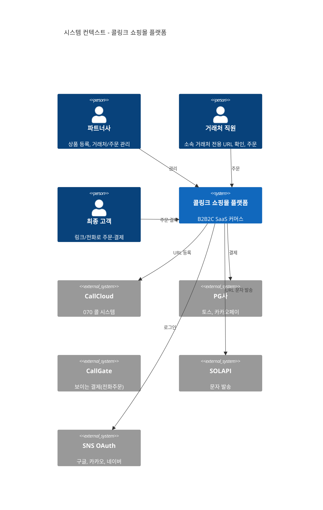

# 점검·감사 (병합 문서)

**병합 소스:** DOCS_REVIEW.md, FLOW_AUDIT_REPORT.md, ARCHITECTURE_DIAGRAM.md, SUPABASE_SCHEMA_AUDIT.md  
**최종 수정:** 2026-02-10

---

## 목차

1. [문서 재점검 (PRD·TRD·ERD)](#1-문서-재점검)
2. [Flow 전수 검사](#2-flow-전수-검사)
3. [기술 아키텍처 다이어그램](#3-기술-아키텍처-다이어그램)
4. [Supabase 스키마 점검](#4-supabase-스키마-점검)

---

## 1. 문서 재점검

**대상:** PRD v1.3, TRD v1.0, ERD v1.0, PROJECT_RULES

| 구분 | 상태 | 조치 |
|------|------|------|
| PRD | 수정 필요 | 거래처 직원/최종 고객 동일 엔티티 명시, 마이페이지 "비밀번호 변경" → "배송지·연락처 관리" 등 |
| TRD | 수정 필요 | client_urls 제거(clients에서 URL 파생), user_clients 명칭 통일 |
| ERD | 보완 권장 | Mermaid products 블록 필드, product_categories parent_id 추가 권장 |
| 일관성 | 양호 | URL 구조, Multi-Tenancy, 역할 정의 정합성 확인 |

**후속:** 역할 결정 로직 명시, 위시리스트(wishlist) TRD vs ERD 검토, Client Admin = /mypage 확장(별도 /admin 없음) PRD·TRD 반영.

---

## 2. Flow 전수 검사

**대상:** PRD, TRD, IMPLEMENTATION_PLAN, PAGE_STRUCTURE_FLOW, ERD, API_SPEC

### 정상 구간

- 파트너 온보딩, 거래처 직원 온보딩(소속 기업 찾기 팝업 → 등록완료 → 메인), M3.5→M4 의존성, 쇼핑 플로우, 주문·재고(T4-6b Atomic).

### 해소된 이슈

- 소속 매칭 화면(팝업·자동완성·등록완료 메시지), 도메인 루트 엔트리(파트너 전용 주문 불가, 거래처 전용 주문 가능), 비로그인 Storefront(브라우징 허용·주문 직전 가드), product_views·M3.5 통합·user_clients role 분기 등.

### 우선 조치

- **L-1:** Client Slug 없음 → 파트너 메인 표시(404 아님). **P-1:** 마이페이지 하위 경로(/mypage/orders, addresses, profile) PAGE_STRUCTURE_FLOW 반영. **D-1~D-3:** checkout API 명세, 장바구니 정책(guest vs DB), product_views 비로그인 정책 — 후순위 문서 보완.

### 모듈 의존성

`M0 → M1 → M2 → M3 → M3.5 → M4 → M5 → M6`

---

## 3. 기술 아키텍처 다이어그램

### 3.1 시스템 컨텍스트 (C4)

### 3.2 아키텍처 블록

- **사용자:** 파트너 Admin, 거래처 직원, 최종 고객  
- **프론트:** 파트너 어드민(Next.js/Tailwind/Shadcn), 거래처 쇼핑몰(Next.js 430px)  
- **백엔드:** Next.js API Routes, 인증·Multi-Tenant 미들웨어  
- **데이터:** PostgreSQL/Supabase, Storage, Auth  
- **외부:** CallCloud, PG, CallGate, SOLAPI, SNS OAuth  

### 3.3 URL 구조

`https://{Partner_Subdomain}.shopping.com/{Client_Slug}` — Host→Partner, Path→Client, client_source_id 세션 저장.

### 3.4 인증·권한

- 거래처 직원/최종 고객 = 동일 엔티티; 소속 매칭(user_clients 1:1) 여부로 구분.  
- 파트너: 기업 미검증 → 기업등록만, 검증 완료 → 대시보드.  
- 구매자: 소속 미매칭 → 소속 기업 찾기 필수; 매칭 완료 → 주문 전용 URL·쇼핑몰 진입.

*(070 연동 시퀀스·배포 다이어그램 등 상세는 원본 ARCHITECTURE_DIAGRAM.md 참고)*

---

## 4. Supabase 스키마 점검

**기준:** docs/ERD.md v1.0, Phase 0 마이그레이션

- **마이그레이션 이력:** 비어 있음(CLI 미사용). **테이블:** 23개 모두 존재(수동/SQL Editor 적용 추정).
- **ERD 대비 차이:**
  - **users:** id FK → auth.users, role에 client_admin 포함 → 앱에서는 client_admin 미사용 권장.
  - **user_clients:** PK=user_id만, status 컬럼 있음(직원 승인 등 확장용).
  - **order_items.product_id:** nullable(ERD는 NOT NULL) — 필요 시 ALTER 또는 앱 레벨 검증.
- **product_inventory:** ERD상 MVP 선택 사항, 현재 없음 — 무방.

**권장:** NextAuth와 public.users 동기화 한 곳에서 처리; users.role은 partner_admin, client_staff, end_customer만 사용.

---

## 변경 이력 (병합)

| 날짜 (KST) | 내용 |
|------------|------|
| 2026-02-10 | DOCS_REVIEW, FLOW_AUDIT_REPORT, ARCHITECTURE_DIAGRAM, SUPABASE_SCHEMA_AUDIT 병합 → AUDIT.md |
