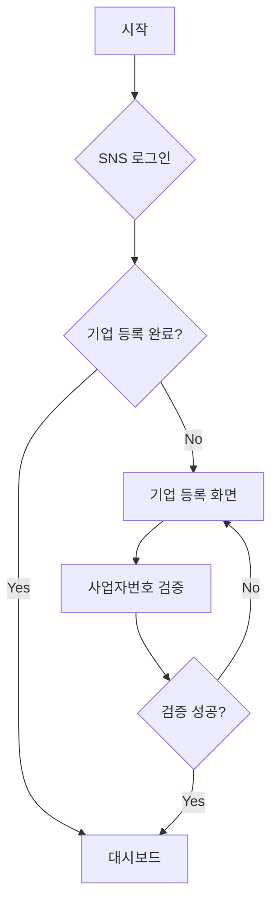
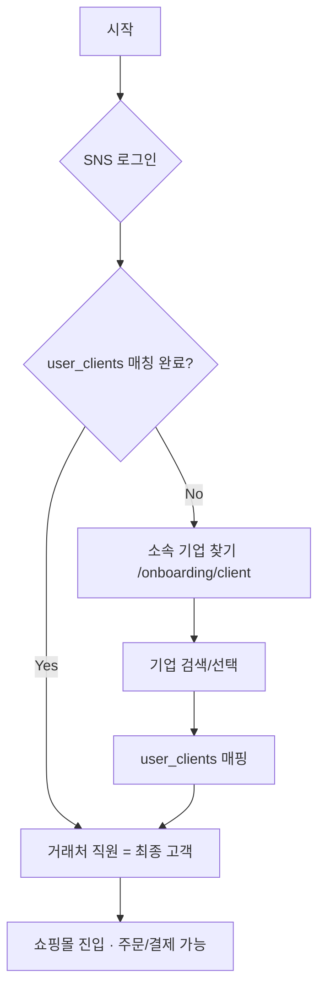
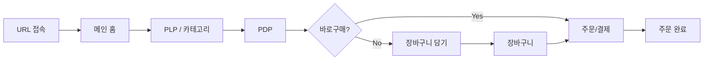

# 페이지 구조도 및 플로우

## 콜링크 쇼핑몰 플랫폼

**문서 버전:** 1.0  
**최종 수정일:** 2026-02-09 16:30 (KST)  
**기준 문서:** PRD v1.3, TRD v1.0

---

## 1. 전체 페이지 구조도

**도메인 루트 엔트리 규칙:**

- `shopping.com`(또는 www) → CallGate 리다이렉트
- `{subdomain}.shopping.com/`(또는 www) → 파트너 메인 마스터 템플릿 (주문 불가)
- `{subdomain}.shopping.com/{clientSlug}` → 거래처 주문 전용 메인 (주문 가능)
- `localhost:3000/` → `localhost:3000/yenmidang/` 리다이렉트

```mermaid
flowchart TB
    subgraph Entry["진입점"]
        E1[도메인 루트]
        E2[Subdomain + Path]
    end

    subgraph PartnerAdmin["파트너 어드민 (/{subdomain}/admin)"]
        PA1["/{subdomain}/admin - 로그인"]
        PA2["/{subdomain}/admin/onboarding/partner - 기업 등록"]
        PA3["/{subdomain}/admin/dashboard - 대시보드"]
        PA4["/{subdomain}/admin/products - 상품 관리"]
        PA5["/{subdomain}/admin/clients - 거래처 관리"]
        PA6["/{subdomain}/admin/orders - 주문 관리"]
        PA7["/{subdomain}/admin/statistics - 통계"]
        PA8["/{subdomain}/admin/notices - 공지·리뷰"]
    end

    subgraph ClientOnboarding["거래처 직원 온보딩"]
        CO1[/onboarding/client - 소속 기업 찾기]
    end

    subgraph Storefront["거래처 사용자 쇼핑몰"]
        SF1[/ - 메인 홈]
        SF2[/products - PLP]
        SF3["/products/[slug] - PDP"]
        SF4[/recent - 최근 본 상품]
        SF5[/delivery - 배송 안내]
        SF6[/wishlist - 관심상품]
        SF7[/cart - 장바구니]
        SF8[/order - 주문/결제]
        SF9[/order/complete - 주문 완료]
        SF10[/mypage - 마이페이지]
    end

    E1 --> PA1
    E2 --> SF1
    PA1 --> PA2
    PA1 --> CO1
    PA2 --> PA3
    CO1 --> SF1
    PA3 --> PA4
    PA3 --> PA5
    PA3 --> PA6
```


---

## 2. URL 라우팅 구조

### 2.1 파트너 어드민 (Admin = 파트너 어드민만. Super Admin 없음)

**라우팅:** `app/[subdomain]/admin/`. 접근: user.role == PARTNER_ADMIN AND user.company_id == subdomain의 파트너.


| 경로                                      | 페이지      | 설명                                                                                                       |
| --------------------------------------- | -------- | -------------------------------------------------------------------------------------------------------- |
| `/{subdomain}/admin`                    | 로그인      | 파트너 어드민 진입·SNS 로그인. 미인증 시 리다이렉트. **역할 분기:** `{subdomain}.shopping.com/admin` 진입 = 파트너(판매자) 가입 의도 → 기업 등록 |
| `/{subdomain}/admin/onboarding/partner` | 기업 등록    | 파트너사 최초 등록                                                                                               |
| `/onboarding/client`                    | 소속 기업 찾기 | end_customer(소속 미확인). 팝업/다이얼로그, 검색+자동완성, 선택→매핑                                                           |
| `/{subdomain}/admin/dashboard`          | 대시보드     | 현황판, 통계                                                                                                  |
| `/{subdomain}/admin/products`           | 상품 목록    | 상품 관리 진입                                                                                                 |
| `/{subdomain}/admin/products/new`       | 상품 등록    | 상품 에디터                                                                                                   |
| `/{subdomain}/admin/products/[id]/edit` | 상품 수정    | 상품 에디터                                                                                                   |
| `/{subdomain}/admin/products/inventory` | 재고 관리    | quantity·safety_stock 수정, Safety Stock 알림(quantity≤safety_stock)                                         |
| `/{subdomain}/admin/categories`         | 카테고리 관리  | 카테고리 CRUD                                                                                                |
| `/{subdomain}/admin/clients`            | 거래처 목록   | 거래처 관리                                                                                                   |
| `/{subdomain}/admin/clients/[id]`       | 거래처 상세   | 다이얼로그 또는 페이지                                                                                             |
| `/{subdomain}/admin/orders`             | 주문 목록    | 주문 관리                                                                                                    |
| `/{subdomain}/admin/orders/[id]`        | 주문 상세    | 상태 변경, 송장                                                                                                |
| `/{subdomain}/admin/statistics`         | 통계       | 매출, 거래처별                                                                                                 |
| `/{subdomain}/admin/notices`            | 공지사항     | 후순위                                                                                                      |
| `/{subdomain}/admin/reviews`            | 리뷰 관리    | 후순위                                                                                                      |


### 2.2 거래처 사용자 쇼핑몰 (Storefront)


| 경로                                           | 페이지          | 설명                                                                                                                         |
| -------------------------------------------- | ------------ | -------------------------------------------------------------------------------------------------------------------------- |
| `/{subdomain}/`                              | 파트너 메인 템플릿   | 파트너 브랜딩(로고), Best Seller, 카테고리 탭, 상품 그리드. **주문 불가** (주문 시도 시 Alert). clientSlug 없음                                         |
| `/{subdomain}/{clientSlug}`                  | 거래처 주문 전용 메인 | CI 이미지(없으면 텍스트) 반영. Hero, Best Item, 카테고리 탭. Bottom Nav [홈] 클릭 시 이동. **주문 가능**                                             |
| `/{subdomain}/{clientSlug}/products`         | PLP          | 상품 목록                                                                                                                      |
| `/{subdomain}/{clientSlug}/products/[slug]`  | PDP          | **거래처별 상품 상세**. samsungelec vs lgdisplay 등 clientSlug별로 서로 다른 URL·페이지                                                      |
| `/{subdomain}/{clientSlug}/recent`           | 최근 본 상품      | 최근 조회 상품 리스트. Bottom Nav [최근 본 상품] 클릭 시 이동                                                                                 |
| `/{subdomain}/{clientSlug}/delivery`         | 배송 안내        | 연락처, 상담시간, 사업자 정보                                                                                                          |
| `/{subdomain}/{clientSlug}/wishlist`         | 관심상품         | Wish List. 2열 그리드, 장바구니 담기. 사이드바 Wish list 클릭 시 이동                                                                         |
| `/{subdomain}/{clientSlug}/cart`             | 장바구니         | 탭(국내/해외배송), 선택·전체상품주문                                                                                                      |
| `/{subdomain}/{clientSlug}/order`            | 주문/결제        | 배송지, 희망배송일 Date Picker, 결제수단. **온보딩 완료 사용자만 가능**                                                                           |
| `/{subdomain}/{clientSlug}/order/complete`   | 주문 완료        | 완료 안내                                                                                                                      |
| `/{subdomain}/{clientSlug}/mypage`           | 마이페이지        | 프로필, 주문 현황, 주문조회, 관심상품, 배송지. **거래처 어드민(CLIENT_ADMIN)** 일 때 직원 승인·전용 주문 내역 조건부 노출                                           |
| `/{subdomain}/{clientSlug}/mypage/orders`    | 주문 내역        | 주문 목록·상세, 배송 추적                                                                                                            |
| `/{subdomain}/{clientSlug}/mypage/addresses` | 배송지 관리       | addresses CRUD                                                                                                             |
| `/{subdomain}/{clientSlug}/mypage/profile`   | 회원정보 수정      | 이름, 연락처                                                                                                                    |
| `/{subdomain}/login`                         | 쇼핑몰 로그인      | 거래처 사용자(주문 시도 등) SNS 로그인. **역할 분기:** `{subdomain}.shopping.com/login` 진입 = 거래처 직원(구매자) 가입 의도 → 소속 매칭. 프로덕션·localhost 동일 규칙 |


### 2.3 개발 환경 (localhost)


| 경로                                        | 설명                                        |
| ----------------------------------------- | ----------------------------------------- |
| `localhost:3000/`                         | `localhost:3000/yenmidang/` 리다이렉트         |
| `localhost:3000/{subdomain}/admin`        | 파트너 어드민 (예: yenmidang/admin). 프로덕션과 동일 규칙 |
| `localhost:3000/{subdomain}/`             | 파트너 메인 (예: yenmidang, wooribugo)          |
| `localhost:3000/{subdomain}/{clientSlug}` | 거래처 메인                                    |
| `localhost:3000/{subdomain}/login`        | 쇼핑몰 로그인 (거래처 사용자. 예: yenmidang/login)     |


---

## 3. 사용자 플로우 다이어그램

### 3.1 파트너사 온보딩 플로우




### 3.2 거래처 직원 온보딩 플로우




**※ 소속 미확인(end_customer) 사용자는 상품 주문 불가. 기업 등록(소속 매칭) 화면만 노출**

### 3.3 최종 고객 쇼핑 플로우




---

## 4. 페이지별 상세 구조

### 4.1 파트너 어드민 — 레이아웃

```
┌─────────────────────────────────────────────────┐
│ Header (bg-black, 로고, 계정정보, 로그아웃)        │
├──────────┬──────────────────────────────────────┤
│ Sidebar  │ Main Content                         │
│          │                                      │
│ - 대시보드│ [페이지별 콘텐츠]                      │
│ - 상품관리│                                      │
│ - 거래처  │                                      │
│ - 주문   │                                      │
│ - 통계   │                                      │
│          │                                      │
└──────────┴──────────────────────────────────────┘
```

### 4.2 파트너 어드민 — 화면별 컴포넌트


| 페이지        | 주요 컴포넌트                                                                                                                             |
| ---------- | ----------------------------------------------------------------------------------------------------------------------------------- |
| **기업 등록**  | 폼 (사업자번호, 사업자명, 대표자, 주소, 연락처 등), 검증 버튼                                                                                              |
| **대시보드**   | 통계 카드 4개, 매출 추이 차트, 인기 상품 Top 5                                                                                                     |
| **상품 목록**  | 검색/필터 바, 데이터 테이블, 페이지네이션, [상품 등록] 버튼                                                                                                |
| **상품 에디터** | 기본정보, 가격, 이미지, 설명, 카테고리, **재고(quantity·safety_stock 등록·수정)**, 옵션, 스티커, 배송                                                           |
| **거래처 목록** | 테이블, [거래처 등록], 다이얼로그 (상세/수정/링크 주소)                                                                                                  |
| **링크 주소**  | 고정 URL + Slug 입력 + [주소 저장] [복사하기] [070번호 연결하기]. 070 버튼 클릭 시 입력 팝업 → client_call_070_configs 저장 → CallCloud Selenium 자동화 (TRD §7 참조) |
| **주문 목록**  | 기간/거래처 필터, 테이블, [상태 변경], [송장 입력]                                                                                                    |


### 4.2-1 거래처 직원 온보딩 — 소속 기업 찾기 (기업 등록/소속 매칭)

**진입 시나리오에 따른 분기:**


| 시나리오       | 진입 경로                 | 소속 매칭                                                                   |
| ---------- | --------------------- | ----------------------------------------------------------------------- |
| **A (링크)** | `/{sub}/{clientSlug}` | 미로그인 → 로그인 유도 → 로그인 완료 즉시 **자동 매칭**(user_clients insert/update). 검색 불필요 |
| **B (일반)** | `/{sub}` 파트너 메인       | 주문 시도 시 user_clients 없으면 **[소속 기업 찾기] 팝업** → 수동 검색·선택→매핑                |


**시나리오 B 전용 — 소속 기업 찾기 팝업 UI:**


| 구역          | 스펙                                                               |
| ----------- | ---------------------------------------------------------------- |
| **표시 방식**   | 모바일 화면. **뒷배경 어둡게** (거의 안 보이게). **팝업 또는 다이얼로그** 오버레이             |
| **메시지**     | "소속 기업이 등록되지 않을 경우, 상품 주문 및 결제가 불가하오니 소속된 기업 정보를 등록해주세요(최초 1회)." |
| **검색 UI**   | 검색창 + 검색 버튼. 기업명 입력 → 검색                                         |
| **자동 완성**   | 입력 시 자동 완성(autocomplete) 지원                                      |
| **결과 선택**   | 검색 결과 목록에서 기업 선택 → user_clients 매핑                               |
| **등록 완료 시** | "기업정보가 정상 등록되었습니다. 앞으로도 많은 이용 부탁드립니다" 표시                         |
| **닫기**      | [닫기] 버튼 또는 [X] 버튼 → 다이얼로그/팝업 닫기 → 쇼핑몰 메인화면으로 리다이렉트               |
| **진행 불가 시** | 쇼핑몰 메인홈 미노출, 주문·결제 불가                                            |


### 4.3 거래처 사용자 쇼핑몰 — 레이아웃

```
┌─────────────────────────────┐
│ Header (햄버거, 로고, 검색, 장바구니) │  max-width: 430px
├─────────────────────────────┤
│                             │
│ Main (스크롤)                 │
│                             │
├─────────────────────────────┤
│ Bottom Nav (홈, 카테고리, 최근본, 마이페이지/배송안내) │
└─────────────────────────────┘
```

### 4.4 거래처 사용자 쇼핑몰 — 화면별 컴포넌트


| 페이지              | 주요 컴포넌트                                                                                                                                                                            |
| ---------------- | ---------------------------------------------------------------------------------------------------------------------------------------------------------------------------------- |
| **메인 홈**         | Hero Banner, Category Tabs. **카테고리별** 섹션 제목 + 상품 4개(2×2) + [MORE VIEW] 반복. 상품 카드: 상품명·할인율·판매가·원가. **품절 시 SOLD OUT 배지**. 클릭 시 PDP 이동                                                |
| **PLP**          | Category Tabs, 상품 그리드(2열, 상품명·할인율·판매가·원가), 필터/정렬, [MORE VIEW], **품절 시 SOLD OUT 배지**                                                                                                |
| **PDP**          | 이미지 갤러리, 제목·가격, 옵션 드롭다운, 수량, 탭(상세/후기/Q&A), Sticky Footer. **품절 시 SOLD OUT 배지·구매 버튼 비활성화**                                                                                          |
| **Bottom Sheet** | 배송방법 4버튼, 매장·희망날짜, [바로구매] [선물하기]                                                                                                                                                   |
| **장바구니**         | 탭(국내/해외배송), 체크박스·썸네일·옵션·수량, [선택상품주문][전체상품주문]                                                                                                                                       |
| **주문/결제**        | 배송지(회원정보동일/새배송지·우편번호), 희망배송일 Date Picker, 결제수단, [결제하기]                                                                                                                             |
| **주문 완료**        | 주문번호, 결제 결과, [쇼핑 계속]                                                                                                                                                               |
| **마이페이지**        | 프로필 카드, 주문 현황 바, 주문조회, 회원정보, 관심상품, 배송지                                                                                                                                             |
| **관심상품**         | 2열 그리드, 썸네일·상품명·가격·삭제·장바구니 담기. Empty: "관심상품 내역이 없습니다"                                                                                                                              |
| **사이드바**         | 상단: (비로그인) "회원가입/로그인" / (로그인) "안녕하세요 [이름]님" + 로그아웃. **회원가입 = OAuth 로그인 진입** (별도 가입 페이지 없음). 퀵 메뉴(Wish list, Cart, My Page, Search), 배너, 아코디언. 햄버거·Bottom Nav [카테고리] 클릭 시 우측 Drawer |
| **최근 본 상품**      | 제목 "최근본상품", 상품 리스트 또는 빈 상태 안내("최근본 상품 내역이 없습니다")                                                                                                                                   |
| **배송 안내**        | 연락처, 상담시간, 사업자 정보 등. 커뮤니티/FAQ 스타일 또는 정적 페이지                                                                                                                                        |
| **404/잘못된 Slug** | §4.5 참조. 아이콘·메시지·[소속 기업 찾기][홈으로] 버튼. MobileLayout, Bottom Nav 숨김                                                                                                                   |


### 4.5 잘못된 경로/만료 Slug 안내 페이지 (404 Error)

**상황:** 유효하지 않은 URL(`.../wrong-slug`) 또는 계약 종료된 거래처 링크 접근 시  
**목표:** 안내 후 '소속 기업 찾기' 또는 '파트너 홈'으로 유도하여 이탈 방지 (Snowfox 모바일 스타일)

**UI 레이아웃 (Mobile, 중앙 정렬)**


| 구역                   | 스펙                                                                            |
| -------------------- | ----------------------------------------------------------------------------- |
| **헤더**               | 파트너 로고. 네비게이션 숨김                                                              |
| **아이콘**              | Lucide `SearchX` size={64} `text-gray-300 mb-4`                               |
| **타이틀**              | `text-xl font-bold text-gray-900` — "원하시는 페이지를 찾을 수 없습니다."                    |
| **서브텍스트**            | `text-sm text-gray-500 text-center` — "주소가 정확한지 확인해 주시거나, 소속 기업을 직접 검색해 보세요." |
| **버튼 1 (Primary)**   | [소속 기업 찾기] → ClientSearchModal(M3.5) 오픈                                       |
| **버튼 2 (Secondary)** | [홈으로 가기] → `router.push('/')` (파트너 메인)                                        |
| **푸터**               | "도움이 필요하신가요? 02-xxxx-xxxx"                                                    |
| **레이아웃**             | MobileLayout 사용, Bottom Nav 숨김                                                |


**시나리오별 문구**


| 케이스                 | 타이틀              | 서브텍스트                               | 추천 액션        |
| ------------------- | ---------------- | ----------------------------------- | ------------ |
| **A. 존재하지 않는 Slug** | 페이지를 찾을 수 없습니다.  | "요청하신 주소(.../abc)는 존재하지 않는 거래처입니다." | [소속 기업 검색하기] |
| **B. 만료/정지 거래처**    | 서비스 이용이 종료되었습니다. | "해당 거래처(삼성전자)의 전용 판매 기간이 종료되었습니다."  | [쇼핑몰 홈으로]    |


**구현:** `app/not-found.tsx` (Global 404) 및 `/{sub}/[clientSlug]` 검증 시 InvalidSlug 컴포넌트

---

## 5. 라우팅·가드 플로우

```mermaid
flowchart TD
    subgraph Request
        R1[Request]
    end

    R1 --> M1{Subdomain 존재?}
    M1 -->|No| M2[루트→CallGate 리다이렉트. Admin은 /{subdomain}/admin]
    M1 -->|Yes| M3{Client Slug 존재?}
    M3 -->|No| M4[파트너 메인 템플릿 /{sub}/ 주문 불가]
    M3 -->|Yes| M5A{Storefront: 로그인?}
    M5A -->|No| M5[Storefront 브라우징]
    M5A -->|Yes| M5B{user_clients 매칭?}
    M5B -->|No| G7[소속 기업 찾기 팝업]
    M5B -->|Yes| M5[Storefront · 주문 가능]

    M2 --> G1{인증됨?}
    G1 -->|No| G2["/{subdomain}/admin"]
    G1 -->|Yes| G3{파트너: 기업검증?}
    G3 -->|No| G4["/{subdomain}/admin/onboarding/partner"]
    G3 -->|Yes| G5{역할?}
    G5 -->|partner_admin| G8[대시보드 등]
    G5 -->|구매자| G6{user_clients 매칭?}
    G6 -->|No| G7[소속 기업 찾기 팝업]
    G6 -->|Yes| M5
```


---

## 6. 개발 우선순위별 페이지 목록

### 6.1 1차 개발 (선순위)


| 순위  | 영역      | 페이지                                                                 | 비고             |
| --- | ------- | ------------------------------------------------------------------- | -------------- |
| 1   | 파트너 온보딩 | 로그인, 기업 등록                                                          | SNS, 사업자 검증    |
| 2   | 상품 관리   | 상품 목록, 등록, 수정, 카테고리, 재고                                             | 에디터 필수 필드      |
| 3   | 거래처 관리  | 거래처 목록, 상세, 링크 주소                                                   | URL 복사, 070 버튼 |
| 4   | 쇼핑몰     | 메인, PLP, PDP, 최근 본 상품, 배송 안내, 관심상품, 장바구니, 주문/결제, 완료. 역할별 Bottom Nav | 모바일 430px      |
| 5   | 주문 관리   | 주문 목록, 상세, 상태 변경                                                    | 송장 입력          |
| 6   | 마이페이지   | 주문 목록, 상세, 회원정보, 배송지, 관심상품                                          |                |


### 6.2 2차 개발 (후순위)


| 순위  | 영역     | 페이지                      | 비고    |
| --- | ------ | ------------------------ | ----- |
| 1   | 070 연동 | [070번호 연결하기] → CallCloud | 별도 모듈 |
| 2   | SOLAPI | URL 문자 발송                |       |
| 3   | 게시판/리뷰 | 공지사항, 리뷰 관리              |       |
| 4   | 통계 고도화 | 매출 분석, 거래처별 분석           |       |


---

## 7. Next.js App Router 디렉터리 구조 (권장)

### 7.1 File Structure

```
app/
├── [subdomain]/                  # 파트너 식별 (예: /yenmidang)
│   ├── admin/                    # 파트너 어드민 (Admin = 파트너 어드민만)
│   │   ├── page.tsx              # /{subdomain}/admin — 로그인 (미인증 시), 리다이렉트 (인증 시)
│   │   ├── layout.tsx            # Sidebar + Header (인증 시). Middleware: PARTNER_ADMIN + company_id 검증
│   │   ├── onboarding/partner/
│   │   ├── dashboard/
│   │   ├── products/
│   │   │   ├── page.tsx
│   │   │   ├── new/
│   │   │   └── [id]/edit/
│   │   ├── products/inventory/
│   │   ├── categories/
│   │   ├── clients/
│   │   ├── orders/
│   │   └── statistics/
│   ├── layout.tsx                # 파트너 공통 레이아웃 (헤더, 푸터)
│   ├── page.tsx                  # 파트너 메인 — 주문 불가, 소속 기업 찾기
│   ├── login/                    # /{sub}/login — 쇼핑몰 로그인
│   │   └── page.tsx
│   └── [clientSlug]/             # 거래처 식별 (예: /yenmidang/samsung)
│       ├── layout.tsx            # 모바일 레이아웃
│       ├── page.tsx              # 거래처 메인 — 주문 가능
│       ├── products/             # PLP
│       ├── recent/               # 최근 본 상품
│       ├── delivery/             # 배송 안내
│       ├── wishlist/             # 관심상품
│       ├── cart/                 # 장바구니
│       ├── order/                # 주문/결제
│       └── mypage/               # 마이페이지 (거래처 어드민 확장: 직원 승인·전용 주문 내역)
├── not-found.tsx                 # 404 / 잘못된 Slug 안내 (P-3, §4.5)
└── api/
    └── ...
```

### 7.2 페이지별 역할 정의 (Role Definition)


| 경로                           | 파일 위치                                   | 역할 및 기능                                                                                                |
| ---------------------------- | --------------------------------------- | ------------------------------------------------------------------------------------------------------ |
| `/{subdomain}/`              | `app/[subdomain]/page.tsx`              | **파트너 메인 (Landing)** — 주문 불가. 상품 노출 시 '주문하기' 비활성화/숨김. M3.5 소속 기업 찾기 팝업/버튼 강조. clientSlug 없이 진입한 방문자 안내 |
| `/{subdomain}/{clientSlug}/` | `app/[subdomain]/[clientSlug]/page.tsx` | **거래처 메인 (Shop)** — 주문 가능. 파트너 상품 DB + 거래처별 가격 정책. B2B 주문 메인 페이지                                       |


### 7.3 개발 가이드 (Phase 4 / M0 라우팅 적용 시점)

#### Localhost Subdomain 시뮬레이션

개발 환경(localhost)에서는 서브도메인이 없으므로, **경로의 첫 번째 세그먼트를 서브도메인으로 인식**합니다. Next.js Middleware를 통한 Rewrite 규칙으로 프로덕션과 동일한 라우팅을 시뮬레이션합니다.

**로컬 테스트:** `http://localhost:3000/{subdomain}/...` 로 접속해서 테스트하세요. (예: `http://localhost:3000/yenmidang/samsungelec`)

**middleware.ts 예시:**

```ts
import { NextRequest, NextResponse } from 'next/server';

export function middleware(req: NextRequest) {
  const url = req.nextUrl;
  const hostname = req.headers.get('host')!;

  // 1. 개발 환경 (Localhost) — 별도 Rewrite 없이 폴더 구조 그대로 접근
  // localhost:3000/yenmidang/login → params.subdomain = 'yenmidang'
  if (hostname.includes('localhost')) {
    return NextResponse.next();
  }

  // 2. 프로덕션 — yenmidang.shopping.com → hostname에서 subdomain 추출 후 Rewrite
  const subdomain = hostname.split('.')[0];
  if (subdomain !== 'www' && subdomain !== 'shopping') {
    url.pathname = `/${subdomain}${url.pathname}`;
    return NextResponse.rewrite(url);
  }

  return NextResponse.next();
}
```


| 환경              | 동작                                                                          |
| --------------- | --------------------------------------------------------------------------- |
| **Development** | `localhost:3000/yenmidang/...` — 경로 첫 세그먼트가 subdomain. Rewrite 없음           |
| **Production**  | `yenmidang.shopping.com/...` — host 파싱 후 `/{subdomain}{pathname}` 로 Rewrite |


---

**app/[subdomain]/page.tsx** (파트너 메인)

```tsx
// app/[subdomain]/page.tsx
import ClientSearchModal from '@/components/onboarding/ClientSearchModal'; // M3.5

export default function PartnerMainPage({ params }: { params: { subdomain: string } }) {
  // 1. 파트너 정보 조회 (서브도메인 검증)
  // 2. 주문 불가 상태 (UI 모드)

  return (
    <main className="flex flex-col items-center justify-center min-h-screen">
      <h1>{params.subdomain} 파트너 홈</h1>
      <p>주문을 하시려면 소속 기업을 선택해주세요.</p>

      {/* M3.5 소속 기업 찾기 진입점 */}
      <ClientSearchModal partnerId={...} />
    </main>
  );
}
```

**app/[subdomain]/[clientSlug]/page.tsx** (거래처 메인)

```tsx
// app/[subdomain]/[clientSlug]/page.tsx
export default function ClientMainPage({ params }: { params: { subdomain: string; clientSlug: string } }) {
  // 1. 파트너 및 거래처(Slug) 검증
  // 2. 주문 가능 상태 (Shop 모드)

  return (
    <main>
      {/* 기존 쇼핑몰 메인 (배너, 카테고리, 상품 리스트) */}
      <ShopHome clientSlug={params.clientSlug} />
    </main>
  );
}
```

---

## 변경 이력


| 날짜         | 시간    | 변경 내용                                                                                                                                       |
| ---------- | ----- | ------------------------------------------------------------------------------------------------------------------------------------------- |
| 2025-02-06 | 16:00 | 상품 에디터 재고 필드, 재고 관리 Safety Stock 알림, 메인·PLP·PDP 품절 SOLD OUT 배지                                                                              |
| 2025-02-06 | 16:30 | Bottom Nav 클릭 동작: [홈]→메인, [카테고리]→Drawer, [최근 본 상품]→/recent, [배송안내]→/delivery. 최근 본 상품·배송 안내 페이지 추가                                          |
| 2025-02-06 | 17:30 | /wishlist 관심상품 추가, 역할별 Bottom Nav(4번째: 직원→마이페이지/고객→배송안내), 장바구니·주문서·마이페이지 상세 UI, 사이드바 로그인 상태                                                 |
| 2025-02-06 | 18:00 | 거래처 담당자 Admin 제외. 라우팅 가드: 구매자→user_clients 매칭 확인. 거래처 직원=최종고객, end_customer=주문불가                                                            |
| 2025-02-06 | 18:30 | 소속 기업 찾기 화면 레이아웃: 모바일 팝업/다이얼로그(뒷배경 어둡게), 검색+자동완성, 등록완료 메시지, [닫기/X]→메인 리다이렉트                                                                 |
| 2025-02-06 | 20:00 | §1 도메인 루트 엔트리 규칙, §2.2 파트너 전용(/{subdomain}/)·거래처 전용(/{subdomain}/{clientSlug}) 구분, §2.3 localhost 경로 시뮬레이션                                  |
| 2026-02-09 | 14:27 | 문서 일시 업데이트                                                                                                                                  |
| 2026-02-09 | 15:32 | 문서 일시 업데이트 (한국 현지 시간 KST 반영)                                                                                                                |
| 2026-02-09 | 16:30 | Flow 전수 검사 반영: §5 라우팅 가드 M3 분기 수정(Client Slug 없음→파트너 메인, 404 아님). G7→소속 기업 찾기 팝업. §2.2 마이페이지 하위 경로(/mypage/orders, /addresses, /profile) 추가 |
| 2026-02-09 | -     | L-3 해소: 파트너 어드민 로그인 /admin. 쇼핑몰 로그인 /{sub}/login. 미인증 리다이렉트 진입 URL 준용(/admin 또는 {sub}/login). §7 App Router admin/·[subdomain]/login 구조     |
| 2026-02-09 | -     | L-4 해소: app/[subdomain]/page.tsx 신설(파트너 메인). §7.2 페이지별 역할 정의, §7.3 개발 가이드(코드 예시) 추가                                                         |
| 2026-02-09 | -     | P-3 해소: §4.5 잘못된/만료 Slug 404·안내 페이지 UI 스펙. app/not-found.tsx, 시나리오 A·B 문구, 개발 가이드                                                           |
| 2026-02-09 | -     | §4.2 링크 주소: [070번호 연결하기] 버튼 클릭 시 입력 팝업·client_call_070_configs·CallCloud Selenium 자동화 상세 반영                                                 |
| 2026-02-09 | -     | P-4 해소: §2.1·§2.2 도메인별 역할 분기(admin→파트너, login→구매자). §4.4 사이드바 "회원가입=OAuth" 명시                                                               |
| 2026-02-10 | -     | §7.3 Localhost Subdomain 시뮬레이션: Middleware Rewrite 규칙, 로컬 테스트 접속 안내 (localhost:3000/{subdomain}/...)                                        |
| 2026-02-10 | -     | Admin 경로: app/[subdomain]/admin/ (Super Admin 제거, 거래처 어드민=/mypage 확장). localhost:3000/{subdomain}/admin                                     |


---

*본 문서는 PRD·TRD를 기준으로 작성되었으며, 구현 진행에 따라 업데이트됩니다.*