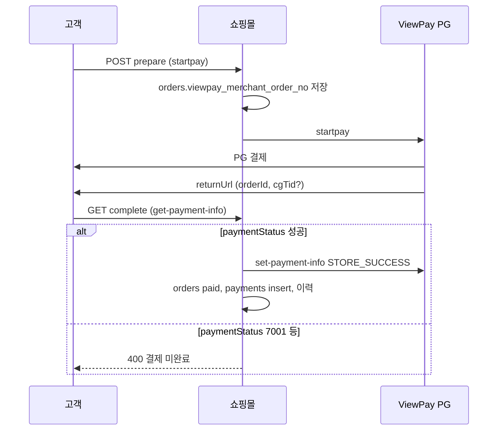

# 결제 오류 운영 점검 체크리스트 (ViewPay / 7001 등)

**대상:** 운영·CS·파트너 어드민  
**최종 수정:** 2026-05-29  
**관련 코드:** `app/api/payment/viewpay/*`, `lib/viewpay-order-completion.ts`

---

## 0. 먼저 수집할 정보

| 항목 | 어디서 얻나 | 용도 |
|------|-------------|------|
| **주문번호** `order_no` | 고객 화면·어드민 주문 상세 | DB 1차 조회 키 |
| **주문 UUID** `orderId` | 결제 완료 URL `?orderId=` | API·로그 상관 |
| **cgTid** (보인 거래 ID) | 완료 URL `cgTid`/`tid`/`cg_tid`, 오류 문구 `(상태: 7001)` 옆, ViewPay BO | PG 조회·우리 `complete` API |
| **발생 시각·환경** | 고객 신고 | Vercel 로그 시간대 필터 |
| **회원/비회원** | 주문 상세 | `guest-sync`·인증 실패 여부 |

> **중요:** 고객에게 보이는 `7001`은 ViewPay **`paymentStatus`** 값입니다. API `result.code=0000`(통신 성공)과 **별개**이며, 우리 서버는 아래 **성공 목록에 없으면 결제 미완료**로 처리합니다.

**우리가 인정하는 성공 `paymentStatus`:**  
`0000`, `PG_APPROVAL_SUCCESS`, `PG_MODULE_SUCCESS`, `PG_MODULE_VIRACC_ISSUE_SUCCESS`

---

## 1. DB는 “로그 DB”가 아님 — Supabase + Vercel

| 저장소 | 내용 |
|--------|------|
| **Supabase (Postgres)** | 주문·결제·이력의 **진실 소스** |
| **Vercel Functions 로그** | `lib/logger` → JSON 한 줄, **`action` 필드로 검색** |
| (별도 결제 전용 log 테이블 없음) | |

---

## 2. cgTid는 어느 테이블에 있나?

| 단계 | cgTid 위치 | 비고 |
|------|------------|------|
| PG 결제 직후·리다이렉트 | **URL 쿼리만** (DB 미저장 가능) | `order/complete?orderId=&cgTid=` |
| `complete` API 성공 후 | **`orders.cg_tid`** | `finalizeViewpayOrderPaid`에서 저장 |
| 동일 시점 | **`payments.pg_txn_id`** | `pg_provider='viewpay'`, `status='completed'` |
| prepare 단계 | **`orders.viewpay_merchant_order_no`** | cgTid 없을 때 `guest-sync`가 PG 조회용 |

**운영 조회 순서 (cgTid를 모를 때):**

```sql
-- 1) 주문번호로 주문 찾기
SELECT id, order_no, payment_status, status, total_amount,
       cg_tid, viewpay_merchant_order_no, paid_at, created_at, is_guest
FROM orders
WHERE order_no = '주문번호';

-- 2) 결제 승인 반영 여부 (cgTid의 DB 기록)
SELECT id, pg_provider, pg_txn_id, amount, status, paid_at, created_at
FROM payments
WHERE order_id = '위 orders.id'
ORDER BY created_at DESC;

-- 3) 결제 완료 이력(우리 시스템이 paid 처리했는지)
SELECT status, memo, created_at
FROM order_status_history
WHERE order_id = '위 orders.id'
ORDER BY created_at DESC;
```

**cgTid를 이미 알 때:**

```sql
SELECT o.id, o.order_no, o.payment_status, o.cg_tid, p.pg_txn_id, p.status AS payment_row_status
FROM orders o
LEFT JOIN payments p ON p.order_id = o.id AND p.pg_provider = 'viewpay'
WHERE o.cg_tid = 'CGTID값'
   OR p.pg_txn_id = 'CGTID값';
```

---

## 3. 결제 플로우와 “어디까지 갔는지” 판정



| 단계 | DB에서 기대되는 상태 | Vercel `action` (검색어) |
|------|----------------------|---------------------------|
| prepare 성공 | `payment_status=pending`, `viewpay_merchant_order_no` 있음 | `payment_viewpay_prepare_success` |
| prepare 실패 | pending, merchant_no 없을 수 있음 | `payment_viewpay_prepare_startpay_failed`, `_rejected` |
| complete 진입 | — | `payment_viewpay_complete_request` |
| get-payment-info 실패 | pending, cg_tid 없음 | `payment_viewpay_complete_get_info_failed` |
| **7001 등 미승인** | pending, cg_tid 없음, payments 없음 | **`payment_viewpay_complete_status_not_success`** |
| 승인·finalize 성공 | `paid`, `cg_tid`, payments `completed` | `payment_viewpay_complete_success`, **`viewpay_finalize_success`** |
| 승인됐으나 DB 반영 실패 | pending 또는 불일치 | `payment_viewpay_complete_finalize_failed`, `viewpay_finalize_order_update_failed` |
| 이미 paid | paid | `payment_viewpay_complete_idempotent` |

**비회원·cgTid 누락 보조:** `POST /api/payment/viewpay/guest-sync`  
→ `viewpay_guest_sync_success` / `viewpay_guest_sync_no_cgtid` / `viewpay_guest_sync_finalize_failed`

---

## 4. 운영자 단계별 체크리스트

### Step 1 — 고객 증상 분류 (1분)

- [ ] 화면 문구에 **`(상태: 7001)`** 등 PG 상태 코드가 있는가? → **PG 미승인·중단** 가능성 큼
- [ ] “결제 완료”인데 주문은 **미결제**인가? → **complete 미호출** 또는 **cgTid 누락** (`docs/PAYMENT_COMPLETE_PAGE_FIX.md` 참고)
- [ ] 카드/계좌 **실제 출금·승인** 여부를 고객·PG BO에서 먼저 확인

### Step 2 — Supabase `orders` (2분)

- [ ] `payment_status`: `paid` vs `pending` / `failed`
- [ ] `status`: 주문 진행 상태 (`received` 등)
- [ ] `cg_tid`: **NULL이면 우리 시스템은 결제 완료 처리 안 함**
- [ ] `viewpay_merchant_order_no`: prepare까지 갔는지
- [ ] `total_amount`: PG 금액과 일치하는지

### Step 3 — `payments` + `order_status_history` (1분)

- [ ] `payments`에 `pg_provider=viewpay`, `status=completed`, `pg_txn_id` 존재 → **내부 결제 완료 기록 있음**
- [ ] `order_status_history`에 `결제 완료 (ViewPay)` 메모 → finalize까지 진행됨
- [ ] `payments`만 있고 `orders.payment_status`가 pending → **데이터 불일치** (즉시 개발 에스컬레이션)

### Step 4 — Vercel 로그 (3~5분)

**경로:** Vercel 프로젝트 → Logs → Functions  
**필터 예:** `payment_viewpay_complete`, `orderId`, `cgTid`, `7001`

| 보이는 `action` | 의미 | 운영 판단 |
|-----------------|------|-----------|
| `payment_viewpay_complete_status_not_success` | get-payment-info는 됐으나 **paymentStatus 비성공 (7001 등)** | **PG 측 미승인** — BO에서 동일 cgTid 조회, 고객 재결제 안내 |
| `payment_viewpay_complete_get_info_failed` | PG 조회 API 실패 | 일시 장애·설정(`VIEWPAY_*`)·cgTid 오타 |
| `payment_viewpay_complete_finalize_failed` | PG는 성공인데 **DB 반영 실패** | **크리티컬** — 개발 즉시, PG 승인 취소 여부와 별도 수동 정합 |
| `payment_viewpay_complete_success` + `viewpay_finalize_success` | 정상 완료 | DB가 paid인지 재확인; 고객 UI·캐시 이슈 |
| `payment_viewpay_complete_idempotent` | 이미 paid | 고객 재진입; 실제는 완료 |
| `payment_viewpay_complete_guest_auth_failed` | 비회원 sig/token 불일치 | 비회원 결제 링크·쿠키 이슈 |
| `payment_viewpay_prepare_*` | 결제창 진입 전 실패 | PG 진입 전 — 주문은 pending 유지 |

### Step 5 — ViewPay(보인) BO (필요 시)

- [ ] **cgTid**로 거래 조회 → 승인/취소/대기 상태
- [ ] 우리 로그의 `paymentStatus`와 BO 상태 **일치 여부**
- [ ] `7001` 코드 의미는 **PG사 코드표·기술지원**으로 확인 (우리 코드에 7001 전용 매핑 없음)

### Step 6 — 최종 판정 매트릭스

| orders.payment_status | orders.cg_tid | payments (viewpay completed) | PG BO | 결론 |
|----------------------|---------------|------------------------------|-------|------|
| pending | NULL | 없음 | 미승인/7001 | **미결제** — 재결제·다른 수단 |
| pending | NULL | 없음 | 승인됨 | **우리 반영 실패** — 개발 긴급 + PG와 정합 |
| paid | 있음 | 있음 | 승인됨 | **정상** — UI/알림만 점검 |
| paid | 있음 | 없음 | 승인됨 | payments insert 실패 로그 확인 (`viewpay_finalize_payment_insert_failed`) — 주문은 paid일 수 있음 |
| pending | 있음 | 없음 | ? | 비정상 — URL만 tid 있고 complete 실패한 케이스 조사 |

### Step 7 — 후속 조치 (역할 분담)

| 상황 | 운영 | 개발 |
|------|------|------|
| 7001 + PG 미승인 | 고객 재결제, 주문 pending 유지 안내 | 코드 변경 불필요 시 PG 문의 |
| PG 승인 + DB pending | **출금 사실 기록**, 티켓 긴급 | `complete` 재호출·수동 paid 검토 (정책 합의 후) |
| paid인데 뉴런 미발주 | 파트너 수동 발주 | `viewpay_finalize_newrun_failed` 로그 |

---

## 5. 어드민·API로 빠르게 보는 방법

- **파트너/중앙 어드민:** 주문 상세에서 `payment_status`, `order_no`
- **운영 전용 (서버 키 필요):** `GET /api/payment/viewpay/info?cgTid=...&orderId=...` — PG `get-payment-info` 프록시 (판정은 complete와 동일 로직 참고)

---

## 6. 7001 케이스 요약

1. 고객 메시지: `결제가 완료되지 않았습니다. (상태: 7001)`
2. DB: 거의 항상 `payment_status=pending`, `cg_tid` NULL, `payments` 없음
3. 로그: **`payment_viewpay_complete_status_not_success`** + `message`에 7001
4. **카드사/PG BO에 승인 없으면** → 미결제로 확정, 재결제
5. **PG BO에만 승인 있으면** → 크리티컬 인시던트, 개발·PG 동시 대응

---

## 7. 관련 문서

- `docs/PAYMENT_COMPLETE_PAGE_FIX.md` — returnUrl에 cgTid 없을 때
- `docs/CHECKOUT_VIEWPAY_LATENCY_IMPROVEMENT.md` — prepare/complete 지연
- `docs/ORDER_UPDATE_FAILURE_ANALYSIS.md` — 주문 반영 실패 사례
