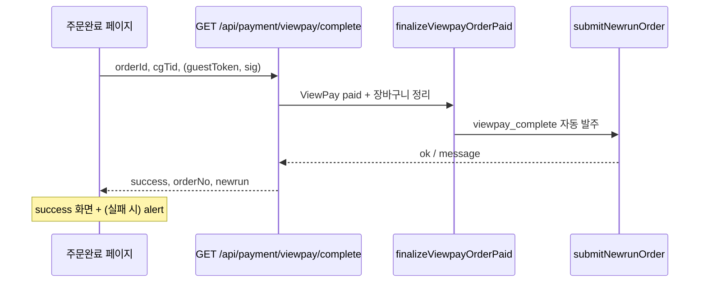

# 개발 홀딩 목록

**목적:** 당장 적용하지 않고 보류·후속 검토로 남겨 두는 과제를 한 곳에서 추적합니다.

**반영 일:** 2026-05-27 (KST) — 하단 「문서 마지막 편집」 참고

---

## 목차

1. [파트너 어드민 사이드바](#1-파트너-어드민-사이드바-componentsadminadminsidebartsx)
2. [알림톡 발송 상세 모달](#2-알림톡-발송-상세-모달-componentsadminalimtalkhistorydetailmodaltsx)
3. [Slack / 070 Incoming Webhook](#3-slack--070-incoming-webhook)
4. [Callcloud 시트 동기화 웹훅](#4-callcloud-시트-동기화-웹훅)
5. [Google Apps Script → 슬랙 (대안 채널)](#5-google-apps-script--슬랙-대안-채널)
6. [상품 관리 vs 재고 관리 (품절 / 재고 부족)](#6-상품-관리-vs-재고-관리-품절--재고-부족)
7. [파트너 어드민 모바일·반응형 레이아웃](#7-파트너-어드민-모바일반응형-레이아웃)
8. [뉴런(Newrun) 자동 발주 — 주문 완료 화면 alert](#8-뉴런newrun-자동-발주--주문-완료-화면-alert)
9. [거래처 로고 업로드 — Storage 버킷(운영)](#9-거래처-로고-업로드--storage-버킷운영)
10. [체크아웃 리본·카드 UI (참고 — 반영 완료)](#10-체크아웃-리본카드-ui-참고--반영-완료)
11. [로그인·마스터 템플릿 고객 노출 차단 (반영 완료)](#11-로그인마스터-템플릿-고객-노출-차단-반영-완료)

---

## 1. 파트너 어드민 사이드바 (`components/admin/AdminSidebar.tsx`)

### 1.1 완료(참고) — 레포 반영됨

| 항목 | 설명 |
|------|------|
| 아코디언 자동 펼침 (정확 일치 라우트) | 2차 메뉴 `href`와 `pathname`이 **완전히 같을 때** 해당 1차 섹션을 펼침 (`expanded`: 활성 자식 구간에서는 강제 `true`). 예: 알림톡 발송 관리 `/admin/clients/messages`. |

### 1.2 홀딩 — `pathname === href` 한계로 잔존 가능한 동일 패턴 이슈

활성 판별이 **문자열 완전 일치**만 사용되어, 아래 경로에서는 **부모 아코디언 자동 미펼침**, **대응되는 2차 링크 하이라이트 없음**이 계속 발생할 수 있음.

| 라우트(예시) | 비고 |
|--------------|------|
| `/admin/clients` | 거래처 목록 페이지. 사이드바에는 `…/clients/links`, `…/clients/messages`만 등재 |
| `/admin/products/new` | 상품 등록 |
| `/admin/products/[id]/edit` | 상품 편집 |
| `/admin/orders/[id]` | 주문 상세 (`/admin/orders`와 경로 불일치) |
| `/admin/onboarding/partner` | 온보딩 레이아웃도 동일 `AdminSidebar` 사용 |
| `/admin/settings` | 설정(모달·직링크 플로우). 사이드 항목 없음 |
| `/admin/settings/integrations` | 연동 테스트 등. 사이드 항목 없음 |

**후속 과제 (미착수):**

- 접두 매칭(`startsWith`)·가장 근접한 부모 네비 선택 등 규칙 설계 및 충돌 정리
- 또는 `pathname → sectionKey`/활성 `href`를 명시하는 맵 추가
- 위 라우트를 사이드에 **항목으로 추가할지**(거래처 목록 등)·UX 정책 확정 후 구현

**전수 검토:** 레포 내 **동일 아코디언 네비 패턴 재사용 컴포넌트는 없음**(`AdminSidebar` 단일). 쇼핑몰 `SideMenu` 등은 별도 도메인.

---

## 2. 알림톡 발송 상세 모달 (`components/admin/AlimtalkHistoryDetailModal.tsx`)

| 구분 | 홀딩 내용 |
|------|-----------|
| **수신자 목록 탭 카피** | 대량 발송 시 **수신자 목록** 탭 상단 안내 문구에 Agent2·`result_code` 설명이 남아 있음. 메시지 탭 초록박스는 삭제했으나 **이 탭까지 용어 통일·안내 간소화·제거**할지는 운영·CS 정책 확인 후 검토 |
| **모달 헤더 문구** | 과거 제안안(예: 「고객 안내 알림톡 메세지」/「고객에게 발송된…」). 현재 레포는 **고객사 Link 안내** 계열 헤더. 재적용 필요 시 디자인·카피 확정 후 별도 스프린트 |
| **`title`(본문 부제 라인)** | 과거 「고객사 Link 안내」한 줄 노출 방식 제거됨. 히스토리만 필요 시 타임라인/목록 타입 라벨을 다른 위치에서 보여 줄지 미정 |

---

## 3. Slack / 070 Incoming Webhook (`lib/integrations/slack-070-queue.ts`)

| 구분 | 홀딩 내용 |
|------|-----------|
| **메시지 끝 공백 줄 강화** | 접수 안내·C2W 완료 안내 메시지 **말미에 빈 줄 1줄** 반영함. Slack UI에서 연속 알림 간격이 **여전히 부족하면** 종료 `\n\n` 두 번(또는 동일 패턴)·Block Kit 등으로 시각 간격 검토 |
| **시트 URL에 `gid` 등** | 접수 안내 「시트 열기」가 `…/spreadsheet/{id}/edit`만 포함. 특정 탭까지 바로 여는 게 필요하면 **`gid`/해시 포함 URL** 규칙 정리 후 적용 검토 |

---

## 4. Callcloud 시트 동기화 웹훅 (`app/api/webhooks/callcloud-sync/route.ts`)

| 구분 | 홀딩 내용 |
|------|-----------|
| **거부/무시 분기 로깅** | 성공 분기에는 `console.info` 있음. **401**(키 불일치), **ignored**(완료가 아닌 status), JSON 파싱 실패 등에는 **운영 디버깅용 한 줄 `console.info`/구조 로그**를 넣을지 선택 과제 |

---

## 5. Google Apps Script → Slack (대안 채널)

| 구분 | 홀딩 내용 |
|------|-----------|
| **클라이언트측 결과 알림** | 시트 편집 후 콜링크 서버 호출 결과를 **GAS에서 직접 슬랙 Webhook으로 전달**하는 방안(네트워크 단 실패 포함 가시화). 현재는 **서버(`/callcloud-sync`) 완료 시 슬랙**만 적용되어 있으며, **이중 채널·시크릿 분리 필요 시** 검토 후 구현 |

---

## 6. 상품 관리 vs 재고 관리 (품절 / 재고 부족)

| 구분 | 홀딩 내용 |
|------|-----------|
| **건수 불일치(예: 품절 필터 2건 vs 재고 부족 8건)** | 상품 관리 **「품절」** 필터는 API에서 **`products.status = sold_out`** 만 조회. 재고 관리 **「재고 부족」**은 **`stock_qty ≤ safety_stock`** 클라이언트 필터(상태 무관). **정의가 달라 숫자가 다를 수 있음** — 버그라기보다 기준 불일치·UX 혼동 |
| **후속 과제** | 용어/툴팁으로 구분 안내, 상품 목록에 **재고 부족 전용 필터**(재고 관리와 동일 조건) 추가, 또는 「품절」라벨을 판매상태로 명시. 재고 페이지 `limit=100` 상한·서버측 low-stock 쿼리·비즈니스 규칙(0재고 시 자동 `sold_out` 등)은 정책 확정 후 구현 |

---

## 7. 파트너 어드민 모바일·반응형 레이아웃

**요약:** 콜링크 쇼핑 **파트너 어드민**은 Tailwind 브레이크포인트(`sm:` / `md:` / `lg:` 등)를 **페이지·모달·카드 단위**에서 일부 사용하지만, **대시보드 뼈대(헤더 + 고정폭 사이드바)**는 폰 우선 설계가 아님. **모바일에서 “반응형 앱처럼” 안정적으로 쓰기 위해선 별도 UX·레이아웃 작업이 홀딩 과제.**

### 7.1 현재 레이아웃 근거(코드)

| 구분 | 파일 | 관찰 |
|------|------|------|
| 셸 | `components/admin/AdminDashboardShell.tsx` | 헤더 아래 `flex` 행으로 **항상 가로 배치**(사이드바 + 메인). `flex-col`(모바일에서 세로 스택) 같은 전환 없음 |
| 사이드바 | `components/admin/AdminSidebar.tsx` | `w-64 shrink-0`(256px) **고정**. 햄버거·오버레이 드로어·접기 없음 → 좁은 뷰포트에서 메인 영역이 상대적으로 과도하게 압축 |
| 헤더 | `components/admin/AdminHeader.tsx` | `Partner Admin`, `뉴런 연동 테스트`, 개발용 토글, `파트너 설정`, `로그아웃`이 **한 줄 가로**(`flex`). `flex-wrap`/축약 메뉴 없음 → 작은 폭에서 **가로 스크롤·밀림** 가능성. 일부 레이블만 `hidden sm:inline`(예: 「우리부고 자동발주」) |
| 페이지 내부 | 여러 컴포넌트 | `AdminPageHeader`, 모달(Dialog), 차트 등에서 `sm:`·`lg:` 등 **국소 반응형** 존재. 이는 **콘텐츠 영역 보조 조정**이지 셸 전체 최적화와는 별개 |

### 7.2 기대 사용자 경험(비공식 검토 결과)

| 환경 | 비고 |
|------|------|
| PC 브라우저 | 현재 레이아웃과 일치하는 **주 사용 환경**으로 보는 것이 자연스러움 |
| 스마트폰 브라우저 | 기능은 접근 가능해도 **내비게이션 밀도·가로폭 부족**으로 운영·CS 업무에는 **비권장**에 가깝다고 판단 가능 |
| 「모바일 앱 수준」 | **별도 과제**(드로어 사이드바, 헤더 액션 축약/메뉴, 주요표 가로 스크롤 UX 등) 없이는 **달성 불가** |

### 7.3 홀딩 후속 과제(미착수)

- 브레이크포인트 정책: 어드민 전용 최소 지원 폭·터치 타깃 크기 확정
- `AdminSidebar`: 모바일에서 **숨김 + 햄버거로 드로어** 또는 하단 탭 등 대안 레이아웃
- `AdminHeader`: `md:` 미만에서 **오버플로 메뉴**(⋯)·아이콘화 또는 2단 래핑
- 각 데이터 테이블/대시보드: 좁은 폭에서 **카드 리스트형** 또는 명시적 `overflow-x` + 스크롤 힌트
- 접근성: 포커스 트랩(드로어)·스킵 링크(skip link) 등 모바일 내비 시 고려 사항 나열 후 스프린트 배정

**문서 반영 근거:** 대화 내 코드 리딩 기준 상태(레포 시점별로 클래스명 변동 가능). 구현 우선순위는 프로덕트·운영 필요에 따라 조정.

---

## 8. 뉴런(Newrun) 자동 발주 — 주문 완료 화면 alert

**요약:** ViewPay **결제는 성공**한 뒤, 고객이 `/{subdomain}/{clientSlug}/order/complete`로 돌아올 때 **뉴런 자동 발주**가 실패하면 브라우저 **`alert` + 토스트**가 뜬다. 주문 완료 본문(「주문이 정상적으로 완료되었습니다」)은 **그대로 표시**된다. (결제 실패가 아님.)

**관련 코드 (추적용):**

| 단계 | 경로 |
|------|------|
| 결제 완료 API | `app/api/payment/viewpay/complete/route.ts` → `finalizeViewpayOrderPaid` |
| paid 반영 + 뉴런 | `lib/viewpay-order-completion.ts` → `submitNewrunOrder(..., { source: "viewpay_complete" })` |
| 폼 매핑·검증 | `lib/newrun/map-order-to-newrun-payload.ts` |
| draft 병합 | `lib/newrun/merge-order-drafts.ts`, `lib/newrun/submit-order.ts` (`loadSubmitContext`) |
| 고객 alert | `app/[subdomain]/[clientSlug]/order/complete/page.tsx` — `applyCompletePayload` 내 `nr.success === false` |

**운영 전제 (실발주):** `NEWRUN_ENABLED=true`, `NEWRUN_MOCK=false`, `NEWRUN_ROSEWEB_ID` / `NEWRUN_ROSEWEB_PW` / `NEWRUN_RW_RETURNURL` 등 설정. (`.env.local.example` §뉴런 참고, `docs/VERCEL_PRODUCTION_ENV_CHECKLIST.md`)

### 8.1 공통 발생 흐름

| 구분 | 내용 |
|------|------|
| API 응답 | `success: true`, `orderNo` 가 있으면 **주문 완료 UI는 성공** |
| 뉴런 실패 시 | `newrun: { success: false, message: "…" }` → `toast` + **`window.alert`** 동시 표시 |
| DB | `orders.payment_status = paid` 는 이미 반영된 상태에서 뉴런만 `newrun_submit_status = failed` 등으로 남을 수 있음 |

### 8.2 케이스 A — `상품코드(rw_menucode) 없음 — 상품 newrun_default_product_draft…`

#### 언제 뜨는가

| 조건 | 설명 |
|------|------|
| **실패 위치** | **우리 서버** — 뉴런 `intranet_post` **HTTP 호출 전** |
| **트리거** | `mapOrderToNewrunPayload(..., { strict: true })` → `NewrunPayloadValidationError` |
| **메시지 원문** | `상품코드(rw_menucode) 없음 — 상품 newrun_default_product_draft(또는 주문 병합 draft)에 rw_menucode 필수` (`lib/newrun/map-order-to-newrun-payload.ts`) |
| **고객 표시** | 위 문자열이 `submitNewrunOrder` → `newrun.message` → 주문 완료 페이지 `alert` |

#### 원인 (상세)

1. **`rw_menucode`는 쇼핑몰 상품명으로 채워지지 않음**  
   - `product.name`, 주문 스냅샷 `product_name`은 매핑에 **사용하지 않음** (코드 주석·정책 명시).

2. **값이 들어오는 DB·병합 경로**

   | 우선순위 | 출처 | 컬럼/필드 |
   |----------|------|-----------|
   | 1 (기본) | 주문 **첫 번째** 품목의 상품 | `products.newrun_default_product_draft` (JSONB) |
   | 2 (덮어쓰기) | 해당 주문 | `orders.newrun_product_draft` (어드민 협회 상품 검색 저장 시) |

   - 병합: `mergeProductDraftForOrder` — **뒤 레이어(주문)가 앞(상품 기본)을 덮음**.
   - draft 키 인식 예: `rw_menucode`, `menucode`, `var_menucode`, `var_mcode`, `goodcode`, `var_goodcode`, `var_code`, `good_code` (`applyProductDraft`).

3. **이 케이스가 나는 대표 상황**

   - 파트너 어드민 **상품 수정** → 「뉴런 발주 — 상품·옵션 기본값」이 `{}` 이거나 `rw_menucode` 없음.
   - 체크아웃만 하고 어드민에서 **주문별 상품 draft**(`newrun_product_draft`) 미저장.
   - **장바구니 복수 품목**: `rw_menucode`는 **첫 번째 `order_items` 행**의 상품 draft만 사용 — 2번째 상품에만 코드가 있어도 실패.

4. **옵션 draft** (`newrun_default_option_draft` / `newrun_option_draft`)는 주로 `shipping_detail`·`rw_custreq` 보조용이며, **옵션만으로 `rw_menucode`가 채워지지는 않음** (상품 draft 경로와 별도).

#### 홀딩 — 후속 조치 (우선순위)

| 우선순위 | 구분 | 조치 |
|----------|------|------|
| **P0** | 운영·데이터 | 판매 중 화훼 상품마다 `products.newrun_default_product_draft`에 협회 **`rw_menucode`**(8자 이내 등 뉴런 규격) 등록 |
| **P0** | 운영 | 장애 주문: Supabase에서 `order_items` → `products.newrun_default_product_draft`, `orders.newrun_product_draft` 확인 |
| **P1** | 운영 | 어드민 주문 상세 → 뉴런 **상품 검색** 저장 후 **수동 재발주** (`OrderDetailNewrunPanel`) |
| **P2** | 코드 (미착수·동의 후) | 뉴런 검증 실패 시 **고객 `alert` 제거** — 완료 화면만, 어드민·웹훅(`lib/newrun/error-webhook.ts`)만 알림 |
| **P2** | 코드 | 상품 저장 시 `rw_menucode` 없으면 어드민 경고 / 「뉴런 발주 필수」 플래그 |
| **P3** | 코드 | 카테고리·SKU별 env 폴백 `rw_menucode` (운영 JSON과 중복·불일치 주의) |

---

### 8.3 케이스 B — `뉴런 발주 실패 (rwr_result=11). 어드민에서 확인 후 수동 재시도할 수 있습니다.`

#### 언제 뜨는가

| 조건 | 설명 |
|------|------|
| **실패 위치** | **뉴런(협회) 서버** — `intranet_post` **POST 후** 응답 파싱 |
| **트리거** | 응답·리다이렉트에서 `rwr_result=11`, 성공(`0`)·중복(`20`)이 아님 |
| **메시지 생성** | `lib/newrun/submit-order.ts` — `ok === false` 일 때 고정 문구 + `rwr` 삽입 |
| **고객 표시** | 케이스 A와 동일 경로로 `alert` |

#### `rwr_result=11` 의미 (레포 기준)

| 출처 | 해석 |
|------|------|
| `lib/newrun/rwr-result-user-message.ts` | 결과코드 **2, 3, 11** → 「입력값·협회 설정 확인」류 |
| `lib/newrun/integration-intranet-post-sample.ts` 주석 | **배달일시(코드 11·12·zz_221 등)** 회피를 위해 테스트 payload에서 `rw_bdate`·`rw_btime`을 익일+고정 시각으로 맞춤 |
| 뉴런 문서 | 부록 A (`docs/NEWRUN_INTEGRATION_PLAN_AND_CHECKLIST.md` §부록 A) — 원문 코드표는 협회·우리부고 문서 기준 |

#### 원인 후보 (우선순위)

| 순위 | 후보 | 연관 필드·비고 |
|------|------|----------------|
| 1 | **배달 일시 불일치** | `rw_bdate`(기본: 주문 `created_at` → `YYYYMMDD`, 본부발주 모드 등 예외), `rw_btime`(`delivery_time_slot` → `HH:MM`, 없으면 `NEWRUN_DEFAULT_RW_BTIME`) |
| 2 | **`rw_menucode` 오류** | 값은 있으나 협회 DB에 없거나 형식 불일치 (케이스 A와 달리 **로컬 검증은 통과**) |
| 3 | **수주화원 `rw_sujuid`** | draft 없으면 기본 `kot4545` / `NEWRUN_DEFAULT_RW_SUJUID` — 거래처·주문 draft와 실제 협회 계정 불일치 |
| 4 | **협회·로즈웹 인증** | `NEWRUN_ROSEWEB_ID`, `NEWRUN_ASSOC_CODE`, `NEWRUN_RW_RETURNURL` 등 |
| 5 | **기타 폼 필드** | 주소·전화·금액·리본 문구 길이 등 (일부만 `truncateField`로 자름) |

#### DB·어드민에서 확인할 컬럼

| 컬럼 | 예시 (실패 시) |
|------|----------------|
| `orders.newrun_rwr_result` | `'11'` |
| `orders.newrun_submit_status` | `'failed'` |
| `orders.newrun_last_submit_error` | `'rwr_result=11'` |
| `orders.desired_delivery_date`, `delivery_time_slot` | 배달일시 원인 추적 |
| `order_status_history` | `뉴런 intranet_post · …` 메모 |

#### 홀딩 — 후속 조치 (우선순위)

| 우선순위 | 구분 | 조치 |
|----------|------|------|
| **P0** | 운영 | 어드민 주문 상세 → **뉴런 발주** 블록·**발주 미리보기**로 실제 POST 필드(`rw_bdate`, `rw_btime`, `rw_menucode`, `rw_sujuid` 등) 확인 |
| **P0** | 운영 | 희망 배송일·시간이 협회 규칙(과거·당일 불가 등)에 맞는지 확인 후 **수동 재발주** |
| **P1** | 운영 | `products.newrun_default_product_draft`의 `rw_menucode`가 주문 상품(예: 축하화환)과 1:1 매칭되는지 재검증 |
| **P2** | 코드 (미착수) | `rwr_result=11`일 때 고객 메시지에 「배달 일시 확인」 등 구체 안내 (내부 코드는 유지) |
| **P2** | 코드 | 발주 전 `rw_bdate`/`rw_btime` 사전 검증(서울 기준 익일 등, `integration-intranet-post-sample` 정책 참고) |
| **P2** | 코드 | 케이스 A와 동일 — 뉴런 실패 시 **고객 `alert` 제거**, 파트너 알림만 |

### 8.4 케이스 A vs B 한눈에 비교

| 구분 | 케이스 A (`rw_menucode` 없음) | 케이스 B (`rwr_result=11`) |
|------|------------------------------|----------------------------|
| 실패 시점 | POST **전** (로컬 검증) | POST **후** (뉴런 응답) |
| 대표 원인 | 상품/주문 draft 미설정 | 협회 측 필드 거절 (배달일시·코드·수주화원 등) |
| 즉시 운영 조치 | 상품 JSON에 `rw_menucode` 등록 | 미리보기·배달일시·코드 점검 후 재발주 |
| 고객 UX | 결제 완료 + **alert** (현행) | 동일 |

### 8.5 홀딩 — 제품·UX 정책 (미확정)

- [ ] 결제 성공 후 뉴런 실패를 **고객에게 alert로 보여줄지** vs **어드민·웹훅만** 할지 정책 확정
- [ ] 스테이징·프로덕션 **전 상품 `rw_menucode` 매트릭스** (상품 slug ↔ 협회 코드) 문서화
- [ ] `NEWRUN_INTEGRATION_PLAN_AND_CHECKLIST.md` T5 스테이징 실연동 체크리스트 잔여 항목과 연동

**문서 반영 근거:** 2026-05-27 프로덕션 주문 완료 화면 스크린샷·코드 리딩(`order/complete`, `submit-order`, `map-order-to-newrun-payload`). **코드 수정은 별도 동의 후** 진행 예정.

---

## 9. 거래처 로고 업로드 — Storage 버킷(운영)

**요약:** 파트너 어드민 **거래처 등록/수정** 모달에서 로고 업로드 시 `POST /api/upload/image` (`bucket=clients`)를 사용한다. 프로덕션 Supabase에 **`clients` 버킷이 없거나** Public·정책이 맞지 않으면 업로드 실패한다.

### 9.1 레포 반영(참고) — 코드 측 개선

| 항목 | 경로·내용 |
|------|-----------|
| 마이그레이션 (수동 적용 필요) | `supabase/migrations/20260528100000_storage_buckets_image_upload.sql.txt` — `products`, `clients`, `banners`, `Partners` 버킷 + 공개 읽기 정책 |
| MIME 추론 | `lib/upload-image-mime.ts` — Windows 등 `file.type` 빈 값 시 확장자로 jpg/png 등 추론 |
| API | `app/api/upload/image/route.ts` — `requirePartnerAccess`, 버킷 없음 시 안내 메시지 |
| 클라이언트 | `lib/admin-upload-image.ts`, `ClientRegistrationModal` — API 오류 문구를 `alert`에 표시 |

### 9.2 홀딩 — 운영 미적용 시 증상

| 증상 | 가능 원인 |
|------|-----------|
| `로고 업로드 중 오류가 발생했습니다.` (구버전 catch만) | 네트워크·401 세션 만료 등 |
| `Storage 버킷 'clients'이 없습니다…` (신규 API 메시지) | 마이그레이션 미실행 |
| `지원하지 않는 파일 형식…` | pdf/heic 등 — jpg/png/webp/gif만 |

### 9.3 홀딩 — 후속 조치

| 우선순위 | 조치 |
|----------|------|
| **P0** | 프로덕션 Supabase SQL Editor에서 `20260528100000_storage_buckets_image_upload.sql.txt` 실행 (또는 Dashboard에서 버킷 id **`clients`** Public 생성 — **대소문자**는 `lib/supabase/storage.ts` `BUCKETS.CLIENTS`와 일치) |
| **P1** | 배포 후 거래처 수정 모달에서 로고 재업로드·`clients.logo_url` 저장 확인 |
| **P2** | `docs/ADMIN_GUIDE.md` Storage 절과 실제 버킷명 대조 |

---

## 10. 체크아웃 리본·카드 UI (참고 — 반영 완료)

**목적:** 홀딩이 아니라 **이미 레포에 반영된** 최근 UX·검증을 추적해, 운영·QA 시 혼동을 줄인다.

| 항목 | 내용 | 주요 경로 |
|------|------|-----------|
| 결제 전 리본 검증 | 근조·축하 화환: 보내는 분·경조사어 필수, 직접입력 빈값 시 alert `(4. 리본 카드 메세지 )정보를 입력해주세요` | `lib/ribbon-checkout-validation.ts`, `checkout` / `guest-order` |
| 꽃다발·기타 기본값 | 리본 경조사어 기본 **직접 입력** (`__custom__`) | `lib/ribbon-default-by-category.ts` |
| 통합 입력 UI | 근조·축하 화환 외: 「리본 경조사어·카드 추가 문구」 단일 textarea, 카드 필드 분리 제거 | `components/shop/RibbonMessageSection.tsx` |
| 비회원 주문 완료 안내 | 주문번호 박스 아래 「비회원은 주문조회를 위해 주문번호를 꼭 기억해주세요.」 | `order/complete/page.tsx` (`guestToken`+`sig` 있을 때) |

---

## 11. 로그인·마스터 템플릿 고객 노출 차단 (반영 완료)

**요약:** 고객에게 `/{subdomain}`(마스터 템플릿)·`/{subdomain}/_preview` 를 보여주지 않고, 로그인 화면 홈·로고는 **거래처 slug** 기준으로 동작하도록 수정함 (2026-05-27).

| 구분 | 내용 |
|------|------|
| slug 복원 | `lib/resolve-shop-client-slug.ts` — callbackUrl → `?clientSlug=` → `last_shop_client_slug` → `client_source_slug` |
| 로그인 | `useShopLoginContext`, `ShopLoginChrome`, `ShopLoginHeader` (로고 onError, 거래처명 우선) |
| 마스터 차단 | `app/[subdomain]/page.tsx` 리다이렉트 전용, `MasterTemplateCustomerGate` (`_preview`는 `partner_admin`만) |
| 어드민 미리보기 | 파트너 어드민은 `/{subdomain}/_preview` 유지, 일반 고객·비로그인은 거래처 홈 또는 로그인으로 이동 |

**운영:** 거래처 로고 이미지는 Storage 버킷(`clients`) + `clients.logo_url` — §9 SQL 적용 후 확인.

---

## 변경 이력

| 일시 (KST) | 내용 |
|------------|------|
| 2026-05-19 | 문서 신설. 사이드바 정확일치 수정 완료 및 접두 불일치 경로·후속 방향 반영 |
| 2026-05-20 | §2 알림톡 모달, §3 Slack, §4 웹훅 로깅, §5 GAS 슬랙 대안 반영. 목차 추가 |
| **2026-05-21 목요일 11:05:00 KST** (Asia/Seoul, UTC+9) | §6 상품/재고(품절 vs 재고 부족) 홀딩·후속 과제 반영. 상단 반영 일 갱신. 변경 이력 컬럼명을 일시로 구체화 |
| **2026-05-19 화요일 18:42:00 KST** (Asia/Seoul, UTC+9) | §7 파트너 어드민 모바일·반응형 레이아웃 홀딩 신설 (`AdminDashboardShell` / `AdminSidebar` / `AdminHeader` 및 국소 `sm:`·`lg:` 대비 정리). 상단 반영 일 갱신. 목차 §7 추가 |
| **2026-05-27** | §8 뉴런 주문 완료 alert (케이스 A `rw_menucode` / 케이스 B `rwr_result=11`) 원인·흐름·운영·코드 홀딩 상세 반영. §9 거래처 로고 Storage 버킷 운영 홀딩. §10 체크아웃 리본·완료 안내(반영 완료 참고). 목차·상단 반영 일 갱신 |
| **2026-05-27** | §11 로그인 slug 복원·마스터 템플릿 고객 노출 차단 구현 완료 (`resolve-shop-client-slug`, `MasterTemplateCustomerGate`, `PartnerRootRedirectPage`) |

---

**문서 마지막 편집:** 2026-05-27 **(KST, Asia/Seoul UTC+9)**

**§8 작성 근거:** 프로덕션 주문 완료 화면 alert 스크린샷·`submit-order` / `map-order-to-newrun-payload` / `order/complete` 코드 리딩. 고객 alert UX 변경·검증 강화는 **미착수(홀딩)**.

**§9 작성 근거:** 거래처 로고 업로드 장애 대응 중 추가된 마이그레이션·MIME·API 개선 — **Supabase 마이그레이션 수동 적용은 운영 홀딩**.
